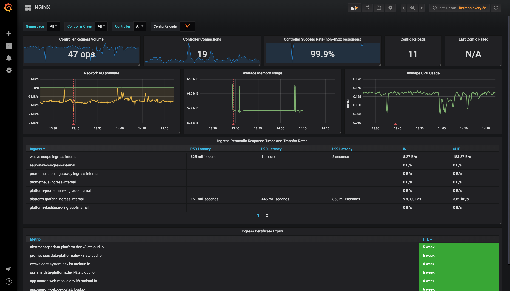

# Grafana Dashboards
Ingress-nginx supports a rich collection of prometheus metrics.  If you have prometheus and grafana installed on your cluster then prometheus will already be scraping this data due to the `scrape` annotation on the deployment.

This folder contains a dashboard that you can import:

## Features

  - Ability to filter by Namespace, Controller Class and Controller
  - Visibility of Request Volume, connections, success rates, config reloads and configs out of sync.
  - Network IO pressure, memory and CPU use
  - Ingress P50, P95 and P99 percentile response times with IN/OUT throughput
  - SSL certificate expiry 
  - Annotational overlays to show when config reloads happened

## Requirements

  - **Grafana v5.2.0** (or newer)
