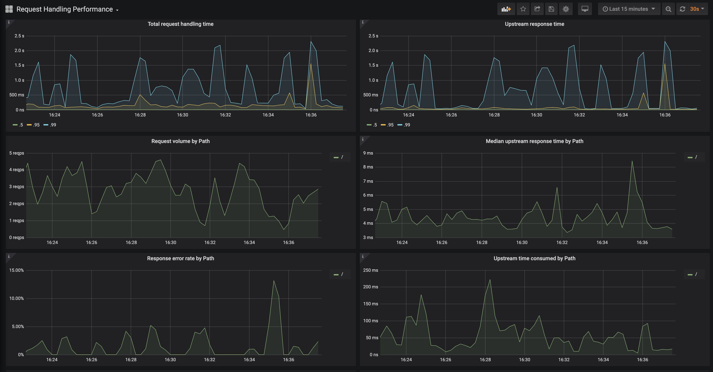

# Grafana Dashboards

Ingress-nginx supports a rich collection of prometheus metrics.  If you have prometheus and grafana installed on your cluster then prometheus will already be scraping this data due to the `scrape` annotation on the deployment.

This folder contains two dashboards that you can import.

## 1. NGINX Ingress Controller

### Features

- Ability to filter by Namespace, Controller Class and Controller
- Visibility of Request Volume, connections, success rates, config reloads and configs out of sync.
- Network IO pressure, memory and CPU use
- Ingress P50, P95 and P99 percentile response times with IN/OUT throughput
- SSL certificate expiry
- Annotational overlays to show when config reloads happened

### Requirements

- **Grafana v5.2.0** (or newer)

## 2. Request Handling Performance

### Features

- Ability to filter by Ingress
- P50, P95 and P99 percentile of total request and upstream response times
- Request volume by path
- Error volume and error rate by path
- Average response time by path
- ...and more

### Requirements

- **Grafana v6.6.0** (or newer)
