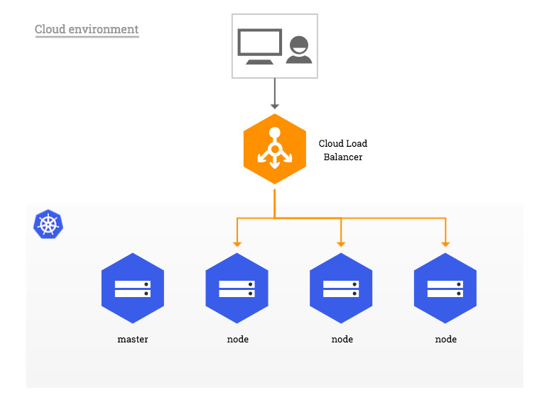
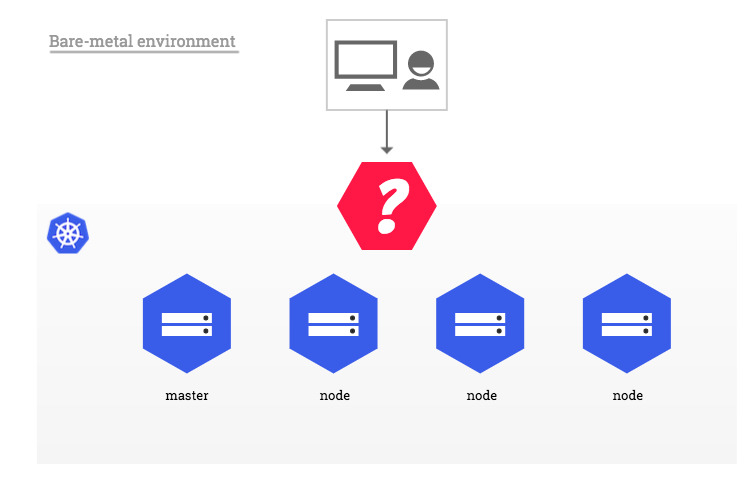
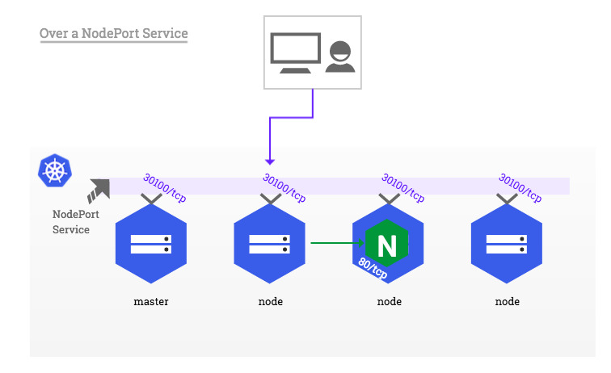
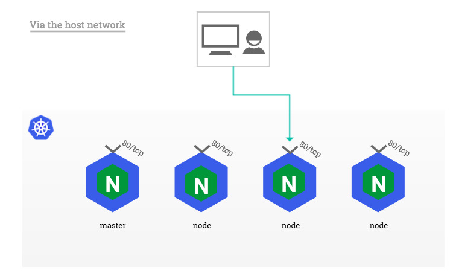
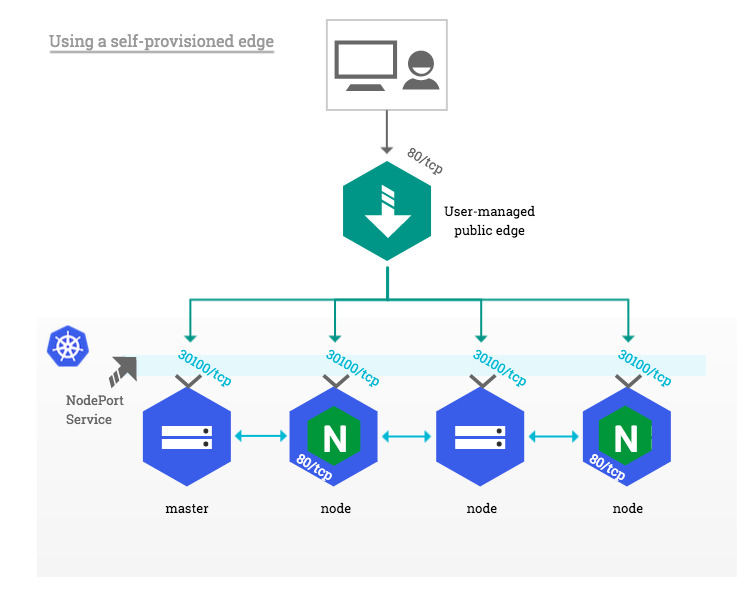

# Bare-metal considerations

In traditional *cloud* environments, where network load balancers are available on-demand, a single Kubernetes manifest
suffices to provide a single point of contact to the NGINX Ingress controller to external clients and, indirectly, to
any application running inside the cluster. *Bare-metal* environments lack this commodity, requiring a slightly
different setup to offer the same kind of access to external consumers.




The rest of this document describes a few recommended approaches to deploying the NGINX Ingress controller inside a
Kubernetes cluster running on bare-metal.

## A pure software solution: MetalLB

[MetalLB][metallb] provides a network load-balancer implementation for Kubernetes clusters that do not run on a
supported cloud provider, effectively allowing the usage of LoadBalancer Services within any cluster.

This section demonstrates how to use the [Layer 2 configuration mode][metallb-l2] of MetalLB together with the NGINX
Ingress controller in a Kubernetes cluster that has **publicly accessible nodes**. In this mode, one node attracts all
the traffic for the `ingress-nginx` Service IP. See [Traffic policies][metallb-trafficpolicies] for more details.


!!! note
    The description of other supported configuration modes is off-scope for this document.

!!! warning
    MetalLB is currently in *beta*. Read about the [Project maturity][metallb-maturity] and make sure you inform
    yourself by reading the official documentation thoroughly.

MetalLB can be deployed either with a simple Kubernetes manifest or with Helm. The rest of this example assumes MetalLB
was deployed following the [Installation][metallb-install] instructions.

MetalLB requires a pool of IP addresses in order to be able to take ownership of the `ingress-nginx` Service. This pool
can be defined in a ConfigMap named `config` located in the same namespace as the MetalLB controller. This pool of IPs **must** be dedicated to MetalLB's use, you can't reuse the Kubernetes node IPs or IPs handed out by a DHCP server.

!!! example
    Given the following 3-node Kubernetes cluster (the external IP is added as an example, in most bare-metal
    environments this value is <None\>)

    ```console
    $ kubectl get node
    NAME     STATUS   ROLES    EXTERNAL-IP
    host-1   Ready    master   203.0.113.1
    host-2   Ready    node     203.0.113.2
    host-3   Ready    node     203.0.113.3
    ```

    After creating the following ConfigMap, MetalLB takes ownership of one of the IP addresses in the pool and updates
    the *loadBalancer* IP field of the `ingress-nginx` Service accordingly.

    ```yaml
    apiVersion: v1
    kind: ConfigMap
    metadata:
      namespace: metallb-system
      name: config
    data:
      config: |
        address-pools:
        - name: default
          protocol: layer2
          addresses:
          - 203.0.113.10-203.0.113.15
    ```

    ```console
    $ kubectl -n ingress-nginx get svc
    NAME                   TYPE          CLUSTER-IP     EXTERNAL-IP  PORT(S)
    default-http-backend   ClusterIP     10.0.64.249    <none>       80/TCP
    ingress-nginx          LoadBalancer  10.0.220.217   203.0.113.10  80:30100/TCP,443:30101/TCP
    ```

As soon as MetalLB sets the external IP address of the `ingress-nginx` LoadBalancer Service, the corresponding entries
are created in the iptables NAT table and the node with the selected IP address starts responding to HTTP requests on
the ports configured in the LoadBalancer Service:

```console
$ curl -D- http://203.0.113.3 -H 'Host: myapp.example.com'
HTTP/1.1 200 OK
Server: nginx/1.15.2
```

!!! tip
    In order to preserve the source IP address in HTTP requests sent to NGINX, it is necessary to use the `Local`
    traffic policy. Traffic policies are described in more details in [Traffic policies][metallb-trafficpolicies] as
    well as in the next section.

[metallb]: https://metallb.universe.tf/
[metallb-maturity]: https://metallb.universe.tf/concepts/maturity/
[metallb-l2]: https://metallb.universe.tf/concepts/layer2/
[metallb-install]: https://metallb.universe.tf/installation/
[metallb-trafficpolicies]: https://metallb.universe.tf/usage/#traffic-policies

## Over a NodePort Service

Due to its simplicity, this is the setup a user will deploy by default when following the steps described in the
[installation guide][install-baremetal].

!!! info
    A Service of type `NodePort` exposes, via the `kube-proxy` component, the **same unprivileged** port (default:
    30000-32767) on every Kubernetes node, masters included. For more information, see [Services][nodeport-def].

In this configuration, the NGINX container remains isolated from the host network. As a result, it can safely bind to
any port, including the standard HTTP ports 80 and 443. However, due to the container namespace isolation, a client
located outside the cluster network (e.g. on the public internet) is not able to access Ingress hosts directly on ports
80 and 443. Instead, the external client must append the NodePort allocated to the `ingress-nginx` Service to HTTP
requests.



!!! example
    Given the NodePort `30100` allocated to the `ingress-nginx` Service

    ```console
    $ kubectl -n ingress-nginx get svc
    NAME                   TYPE        CLUSTER-IP     PORT(S)
    default-http-backend   ClusterIP   10.0.64.249    80/TCP
    ingress-nginx          NodePort    10.0.220.217   80:30100/TCP,443:30101/TCP
    ```

    and a Kubernetes node with the public IP address `203.0.113.2` (the external IP is added as an example, in most
    bare-metal environments this value is <None\>)

    ```console
    $ kubectl get node
    NAME     STATUS   ROLES    EXTERNAL-IP
    host-1   Ready    master   203.0.113.1
    host-2   Ready    node     203.0.113.2
    host-3   Ready    node     203.0.113.3
    ```

    a client would reach an Ingress with `host: myapp.example.com` at `http://myapp.example.com:30100`, where the
    myapp.example.com subdomain resolves to the 203.0.113.2 IP address.

!!! danger "Impact on the host system"
    While it may sound tempting to reconfigure the NodePort range using the `--service-node-port-range` API server flag
    to include unprivileged ports and be able to expose ports 80 and 443, doing so may result in unexpected issues
    including (but not limited to) the use of ports otherwise reserved to system daemons and the necessity to grant
    `kube-proxy` privileges it may otherwise not require.

    This practice is therefore **discouraged**. See the other approaches proposed in this page for alternatives.

This approach has a few other limitations one ought to be aware of:

* **Source IP address**

Services of type NodePort perform [source address translation][nodeport-nat] by default. This means the source IP of a
HTTP request is always **the IP address of the Kubernetes node that received the request** from the perspective of
NGINX.

The recommended way to preserve the source IP in a NodePort setup is to set the value of the `externalTrafficPolicy`
field of the `ingress-nginx` Service spec to `Local` ([example][preserve-ip]).

!!! warning
    This setting effectively **drops packets** sent to Kubernetes nodes which are not running any instance of the NGINX
    Ingress controller. Consider [assigning NGINX Pods to specific nodes][pod-assign] in order to control on what nodes
    the NGINX Ingress controller should be scheduled or not scheduled.

!!! example
    In a Kubernetes cluster composed of 3 nodes (the external IP is added as an example, in most bare-metal environments
    this value is <None\>)

    ```console
    $ kubectl get node
    NAME     STATUS   ROLES    EXTERNAL-IP
    host-1   Ready    master   203.0.113.1
    host-2   Ready    node     203.0.113.2
    host-3   Ready    node     203.0.113.3
    ```

    with a `ingress-nginx-controller` Deployment composed of 2 replicas

    ```console
    $ kubectl -n ingress-nginx get pod -o wide
    NAME                                       READY   STATUS    IP           NODE
    default-http-backend-7c5bc89cc9-p86md      1/1     Running   172.17.1.1   host-2
    ingress-nginx-controller-cf9ff8c96-8vvf8   1/1     Running   172.17.0.3   host-3
    ingress-nginx-controller-cf9ff8c96-pxsds   1/1     Running   172.17.1.4   host-2
    ```

    Requests sent to `host-2` and `host-3` would be forwarded to NGINX and original client's IP would be preserved,
    while requests to `host-1` would get dropped because there is no NGINX replica running on that node.

* **Ingress status**

Because NodePort Services do not get a LoadBalancerIP assigned by definition, the NGINX Ingress controller **does not
update the status of Ingress objects it manages**.

```console
$ kubectl get ingress
NAME           HOSTS               ADDRESS   PORTS
test-ingress   myapp.example.com             80
```

Despite the fact there is no load balancer providing a public IP address to the NGINX Ingress controller, it is possible
to force the status update of all managed Ingress objects by setting the `externalIPs` field of the `ingress-nginx`
Service.

!!! warning
    There is more to setting `externalIPs` than just enabling the NGINX Ingress controller to update the status of
    Ingress objects. Please read about this option in the [Services][external-ips] page of official Kubernetes
    documentation as well as the section about [External IPs](#external-ips) in this document for more information.

!!! example
    Given the following 3-node Kubernetes cluster (the external IP is added as an example, in most bare-metal
    environments this value is <None\>)

    ```console
    $ kubectl get node
    NAME     STATUS   ROLES    EXTERNAL-IP
    host-1   Ready    master   203.0.113.1
    host-2   Ready    node     203.0.113.2
    host-3   Ready    node     203.0.113.3
    ```

    one could edit the `ingress-nginx` Service and add the following field to the object spec

    ```yaml
    spec:
      externalIPs:
      - 203.0.113.1
      - 203.0.113.2
      - 203.0.113.3
    ```

    which would in turn be reflected on Ingress objects as follows:

    ```console
    $ kubectl get ingress -o wide
    NAME           HOSTS               ADDRESS                               PORTS
    test-ingress   myapp.example.com   203.0.113.1,203.0.113.2,203.0.113.3   80
    ```

* **Redirects**

As NGINX is **not aware of the port translation operated by the NodePort Service**, backend applications are responsible
for generating redirect URLs that take into account the URL used by external clients, including the NodePort.

!!! example
    Redirects generated by NGINX, for instance HTTP to HTTPS or `domain` to `www.domain`, are generated without
    NodePort:

    ```console
    $ curl -D- http://myapp.example.com:30100`
    HTTP/1.1 308 Permanent Redirect
    Server: nginx/1.15.2
    Location: https://myapp.example.com/  #-> missing NodePort in HTTPS redirect
    ```

[install-baremetal]: ./index.md#bare-metal
[nodeport-def]: https://kubernetes.io/docs/concepts/services-networking/service/#nodeport
[nodeport-nat]: https://kubernetes.io/docs/tutorials/services/source-ip/#source-ip-for-services-with-type-nodeport
[pod-assign]: https://kubernetes.io/docs/concepts/configuration/assign-pod-node/
[preserve-ip]: https://github.com/kubernetes/ingress-nginx/blob/nginx-0.19.0/deploy/provider/aws/service-nlb.yaml#L12-L14

## Via the host network

In a setup where there is no external load balancer available but using NodePorts is not an option, one can configure
`ingress-nginx` Pods to use the network of the host they run on instead of a dedicated network namespace. The benefit of
this approach is that the NGINX Ingress controller can bind ports 80 and 443 directly to Kubernetes nodes' network
interfaces, without the extra network translation imposed by NodePort Services.

!!! note
    This approach does not leverage any Service object to expose the NGINX Ingress controller. If the `ingress-nginx`
    Service exists in the target cluster, it is **recommended to delete it**.

This can be achieved by enabling the `hostNetwork` option in the Pods' spec.

```yaml
template:
  spec:
    hostNetwork: true
```

!!! danger "Security considerations"
    Enabling this option **exposes every system daemon to the NGINX Ingress controller** on any network interface,
    including the host's loopback. Please evaluate the impact this may have on the security of your system carefully.

!!! example
    Consider this `ingress-nginx-controller` Deployment composed of 2 replicas, NGINX Pods inherit from the IP address
    of their host instead of an internal Pod IP.

    ```console
    $ kubectl -n ingress-nginx get pod -o wide
    NAME                                       READY   STATUS    IP            NODE
    default-http-backend-7c5bc89cc9-p86md      1/1     Running   172.17.1.1    host-2
    ingress-nginx-controller-5b4cf5fc6-7lg6c   1/1     Running   203.0.113.3   host-3
    ingress-nginx-controller-5b4cf5fc6-lzrls   1/1     Running   203.0.113.2   host-2
    ```

One major limitation of this deployment approach is that only **a single NGINX Ingress controller Pod** may be scheduled
on each cluster node, because binding the same port multiple times on the same network interface is technically
impossible. Pods that are unschedulable due to such situation fail with the following event:

```console
$ kubectl -n ingress-nginx describe pod <unschedulable-ingress-nginx-controller-pod>
...
Events:
  Type     Reason            From               Message
  ----     ------            ----               -------
  Warning  FailedScheduling  default-scheduler  0/3 nodes are available: 3 node(s) didn't have free ports for the requested pod ports.
```

One way to ensure only schedulable Pods are created is to deploy the NGINX Ingress controller as a *DaemonSet* instead
of a traditional Deployment.

!!! info
    A DaemonSet schedules exactly one type of Pod per cluster node, masters included, unless a node is configured to
    [repel those Pods][taints]. For more information, see [DaemonSet][daemonset].

Because most properties of DaemonSet objects are identical to Deployment objects, this documentation page leaves the
configuration of the corresponding manifest at the user's discretion.



Like with NodePorts, this approach has a few quirks it is important to be aware of.

* **DNS resolution**

Pods configured with `hostNetwork: true` do not use the internal DNS resolver (i.e. *kube-dns* or *CoreDNS*), unless
their `dnsPolicy` spec field is set to [`ClusterFirstWithHostNet`][dnspolicy]. Consider using this setting if NGINX is
expected to resolve internal names for any reason.

* **Ingress status**

Because there is no Service exposing the NGINX Ingress controller in a configuration using the host network, the default
`--publish-service` flag used in standard cloud setups **does not apply** and the status of all Ingress objects remains
blank.

```console
$ kubectl get ingress
NAME           HOSTS               ADDRESS   PORTS
test-ingress   myapp.example.com             80
```

Instead, and because bare-metal nodes usually don't have an ExternalIP, one has to enable the
[`--report-node-internal-ip-address`][cli-args] flag, which sets the status of all Ingress objects to the internal IP
address of all nodes running the NGINX Ingress controller.

!!! example
    Given a `ingress-nginx-controller` DaemonSet composed of 2 replicas

    ```console
    $ kubectl -n ingress-nginx get pod -o wide
    NAME                                       READY   STATUS    IP            NODE
    default-http-backend-7c5bc89cc9-p86md      1/1     Running   172.17.1.1    host-2
    ingress-nginx-controller-5b4cf5fc6-7lg6c   1/1     Running   203.0.113.3   host-3
    ingress-nginx-controller-5b4cf5fc6-lzrls   1/1     Running   203.0.113.2   host-2
    ```

    the controller sets the status of all Ingress objects it manages to the following value:

    ```console
    $ kubectl get ingress -o wide
    NAME           HOSTS               ADDRESS                   PORTS
    test-ingress   myapp.example.com   203.0.113.2,203.0.113.3   80
    ```

!!! note
    Alternatively, it is possible to override the address written to Ingress objects using the
    `--publish-status-address` flag. See [Command line arguments][cli-args].

[taints]: https://kubernetes.io/docs/concepts/configuration/taint-and-toleration/
[daemonset]: https://kubernetes.io/docs/concepts/workloads/controllers/daemonset/
[dnspolicy]: https://kubernetes.io/docs/concepts/services-networking/dns-pod-service/#pod-s-dns-policy
[cli-args]: ../user-guide/cli-arguments.md

## Using a self-provisioned edge

Similarly to cloud environments, this deployment approach requires an edge network component providing a public
entrypoint to the Kubernetes cluster. This edge component can be either hardware (e.g. vendor appliance) or software
(e.g. _HAproxy_) and is usually managed outside of the Kubernetes landscape by operations teams.

Such deployment builds upon the NodePort Service described above in [Over a NodePort Service](#over-a-nodeport-service),
with one significant difference: external clients do not access cluster nodes directly, only the edge component does.
This is particularly suitable for private Kubernetes clusters where none of the nodes has a public IP address.

On the edge side, the only prerequisite is to dedicate a public IP address that forwards all HTTP traffic to Kubernetes
nodes and/or masters. Incoming traffic on TCP ports 80 and 443 is forwarded to the corresponding HTTP and HTTPS NodePort
on the target nodes as shown in the diagram below:



## External IPs

!!! danger "Source IP address"
    This method does not allow preserving the source IP of HTTP requests in any manner, it is therefore **not
    recommended** to use it despite its apparent simplicity.

The `externalIPs` Service option was previously mentioned in the [NodePort](#over-a-nodeport-service) section.

As per the [Services][external-ips] page of the official Kubernetes documentation, the `externalIPs` option causes
`kube-proxy` to route traffic sent to arbitrary IP addresses **and on the Service ports** to the endpoints of that
Service. These IP addresses **must belong to the target node**.

!!! example
    Given the following 3-node Kubernetes cluster (the external IP is added as an example, in most bare-metal
    environments this value is <None\>)

    ```console
    $ kubectl get node
    NAME     STATUS   ROLES    EXTERNAL-IP
    host-1   Ready    master   203.0.113.1
    host-2   Ready    node     203.0.113.2
    host-3   Ready    node     203.0.113.3
    ```

    and the following `ingress-nginx` NodePort Service

    ```console
    $ kubectl -n ingress-nginx get svc
    NAME                   TYPE        CLUSTER-IP     PORT(S)
    ingress-nginx          NodePort    10.0.220.217   80:30100/TCP,443:30101/TCP
    ```

    One could set the following external IPs in the Service spec, and NGINX would become available on both the NodePort
    and the Service port:

    ```yaml
    spec:
      externalIPs:
      - 203.0.113.2
      - 203.0.113.3
    ```

    ```console
    $ curl -D- http://myapp.example.com:30100
    HTTP/1.1 200 OK
    Server: nginx/1.15.2

    $ curl -D- http://myapp.example.com
    HTTP/1.1 200 OK
    Server: nginx/1.15.2
    ```

    We assume the myapp.example.com subdomain above resolves to both 203.0.113.2 and 203.0.113.3 IP addresses.

[external-ips]: https://kubernetes.io/docs/concepts/services-networking/service/#external-ips
