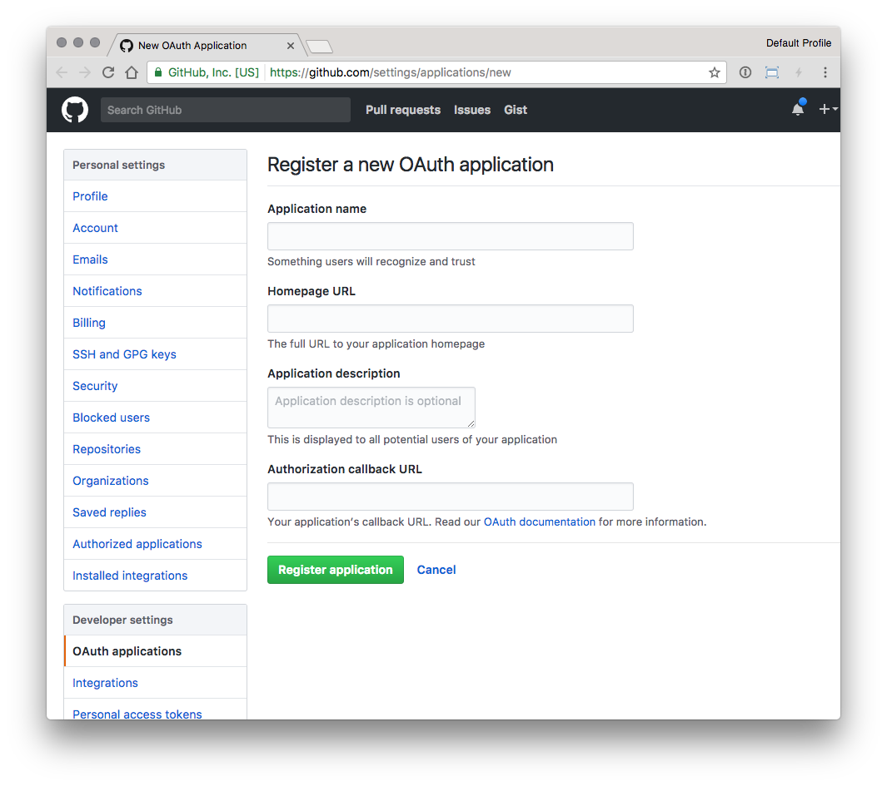
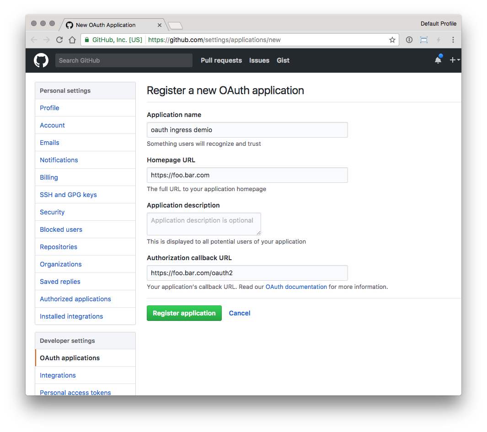
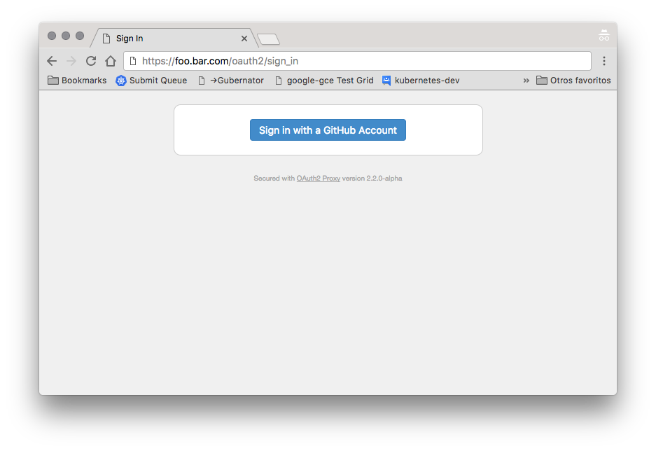

# External OAUTH Authentication

### Overview

The `auth-url` and `auth-signin` annotations allow you to use an external
authentication provider to protect your Ingress resources.

!!! Important
    This annotation requires `nginx-ingress-controller v0.9.0` or greater.)

### Key Detail

This functionality is enabled by deploying multiple Ingress objects for a single host.
One Ingress object has no special annotations and handles authentication.

Other Ingress objects can then be annotated in such a way that require the user to
authenticate against the first Ingress's endpoint, and can redirect `401`s to the
same endpoint.

Sample:

```yaml
...
metadata:
  name: application
  annotations:
    nginx.ingress.kubernetes.io/auth-url: "https://$host/oauth2/auth"
    nginx.ingress.kubernetes.io/auth-signin: "https://$host/oauth2/start?rd=$escaped_request_uri"
...
```

### Example: OAuth2 Proxy + Kubernetes-Dashboard

This example will show you how to deploy [`oauth2_proxy`](https://github.com/pusher/oauth2_proxy)
into a Kubernetes cluster and use it to protect the Kubernetes Dashboard using github as oAuth2 provider

#### Prepare

1. Install the kubernetes dashboard

```console
kubectl create -f https://raw.githubusercontent.com/kubernetes/kops/master/addons/kubernetes-dashboard/v1.10.1.yaml
```

2. Create a [custom Github OAuth application](https://github.com/settings/applications/new)



- Homepage URL is the FQDN in the Ingress rule, like `https://foo.bar.com`
- Authorization callback URL is the same as the base FQDN plus `/oauth2`, like `https://foo.bar.com/oauth2`



3. Configure oauth2_proxy values in the file [`oauth2-proxy.yaml`](https://raw.githubusercontent.com/kubernetes/ingress-nginx/master/docs/examples/auth/oauth-external-auth/oauth2-proxy.yaml) with the values:

- OAUTH2_PROXY_CLIENT_ID with the github `<Client ID>`
- OAUTH2_PROXY_CLIENT_SECRET with the github `<Client Secret>`
- OAUTH2_PROXY_COOKIE_SECRET with value of `python -c 'import os,base64; print(base64.b64encode(os.urandom(16)).decode("ascii"))'`

4. Customize the contents of the file [`dashboard-ingress.yaml`](https://raw.githubusercontent.com/kubernetes/ingress-nginx/master/docs/examples/auth/oauth-external-auth/dashboard-ingress.yaml):

Replace `__INGRESS_HOST__` with a valid FQDN and `__INGRESS_SECRET__` with a Secret with a valid SSL certificate.

5. Deploy the oauth2 proxy and the ingress rules running:

```console
$ kubectl create -f oauth2-proxy.yaml,dashboard-ingress.yaml
```

Test the oauth integration accessing the configured URL, like `https://foo.bar.com`




