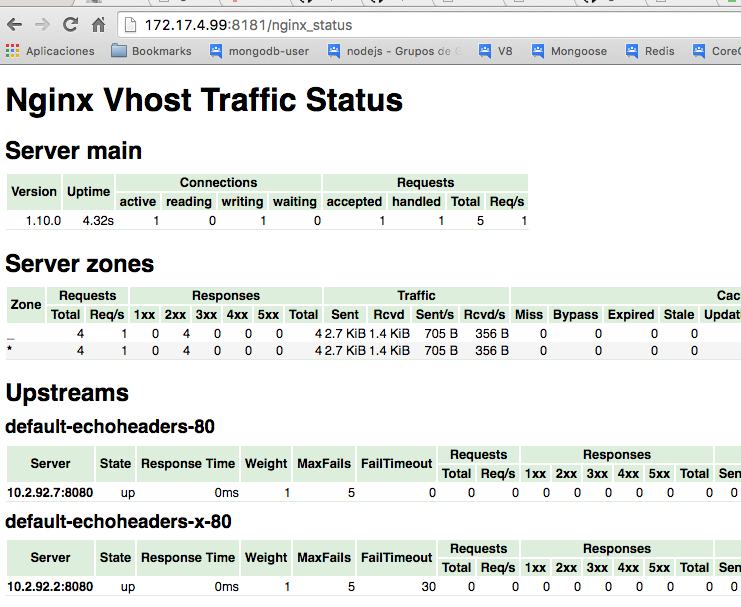

# Custom Upstream server checks

This example shows how is possible to create a custom configuration for a particular upstream associated with an Ingress rule.

```
echo "
apiVersion: extensions/v1beta1
kind: Ingress
metadata:
  name: http-svc
  annotations:
    nginx.ingress.kubernetes.io/upstream-fail-timeout: "30"
spec:
  rules:
  - host: foo.bar.com
    http:
      paths:
      - path: /
        backend:
          serviceName: http-svc
          servicePort: 80
" | kubectl create -f -
```

Check the annotation is present in the Ingress rule:
```
kubectl get ingress http-svc -o yaml
```

Check the NGINX configuration is updated using kubectl or the status page:

```
$ kubectl exec nginx-ingress-controller-v1ppm cat /etc/nginx/nginx.conf
```

```
....
    upstream default-http-svc-x-80 {
        least_conn;
        server 10.2.92.2:8080 max_fails=5 fail_timeout=30;

    }
....
```



