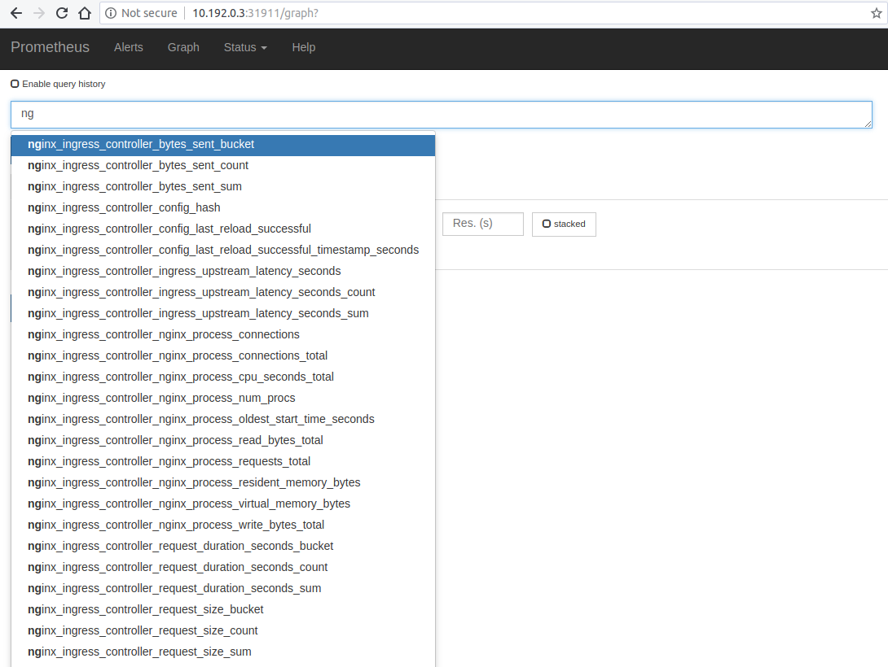
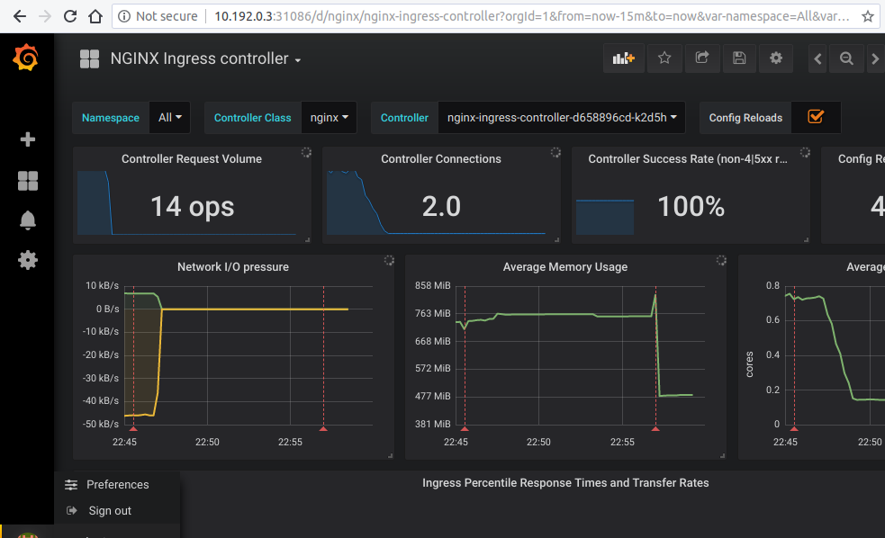

# Prometheus and Grafana installation

This tutorial will show you how to install [Prometheus](https://prometheus.io/) and [Grafana](https://grafana.com/) for scraping the metrics of the NGINX Ingress controller.

!!! important
    This example uses `emptyDir` volumes for Prometheus and Grafana. This means once the pod gets terminated you will lose all the data.

## Before You Begin

The NGINX Ingress controller should already be deployed according to the deployment instructions [here](../deploy/index.md).

Note that the kustomize bases used in this tutorial are stored in the [deploy](https://github.com/kubernetes/ingress-nginx/tree/master/deploy) folder of the GitHub repository [kubernetes/ingress-nginx](https://github.com/kubernetes/ingress-nginx).

## Deploy and configure Prometheus Server

The Prometheus server must be configured so that it can discover endpoints of services. If a Prometheus server is already running in the cluster and if it is configured in a way that it can find the ingress controller pods, no extra configuration is needed.

If there is no existing Prometheus server running, the rest of this tutorial will guide you through the steps needed to deploy a properly configured Prometheus server.

Running the following command deploys prometheus in Kubernetes:

```console
kubectl apply --kustomize github.com/kubernetes/ingress-nginx/deploy/prometheus/
```

### Prometheus Dashboard

Open Prometheus dashboard in a web browser:

```console
kubectl get svc -n ingress-nginx
NAME                   TYPE        CLUSTER-IP      EXTERNAL-IP   PORT(S)                                      AGE
default-http-backend   ClusterIP   10.103.59.201   <none>        80/TCP                                       3d
ingress-nginx          NodePort    10.97.44.72     <none>        80:30100/TCP,443:30154/TCP,10254:32049/TCP   5h
prometheus-server      NodePort    10.98.233.86    <none>        9090:32630/TCP                               1m
```

Obtain the IP address of the nodes in the running cluster:

```console
kubectl get nodes -o wide
```

In some cases where the node only have internal IP addresses we need to execute:

```console
kubectl get nodes --selector=kubernetes.io/role!=master -o jsonpath={.items[*].status.addresses[?\(@.type==\"InternalIP\"\)].address}
10.192.0.2 10.192.0.3 10.192.0.4
```

Open your browser and visit the following URL: _http://{node IP address}:{prometheus-svc-nodeport}_ to load the Prometheus Dashboard.

According to the above example, this URL will be http://10.192.0.3:32630



### Grafana

```console
kubectl apply --kustomize github.com/kubernetes/ingress-nginx/deploy/grafana/
```

```console
kubectl get svc -n ingress-nginx
NAME                   TYPE        CLUSTER-IP      EXTERNAL-IP   PORT(S)                                      AGE
default-http-backend   ClusterIP   10.103.59.201   <none>        80/TCP                                       3d
ingress-nginx          NodePort    10.97.44.72     <none>        80:30100/TCP,443:30154/TCP,10254:32049/TCP   5h
prometheus-server      NodePort    10.98.233.86    <none>        9090:32630/TCP                               10m
grafana                NodePort    10.98.233.87    <none>        3000:31086/TCP                               10m
```

Open your browser and visit the following URL: _http://{node IP address}:{grafana-svc-nodeport}_ to load the Grafana Dashboard.
According to the above example, this URL will be http://10.192.0.3:31086

The username and password is `admin`

After the login you can import the Grafana dashboard from [official dashboards](https://github.com/kubernetes/ingress-nginx/tree/master/deploy/grafana/dashboards)


