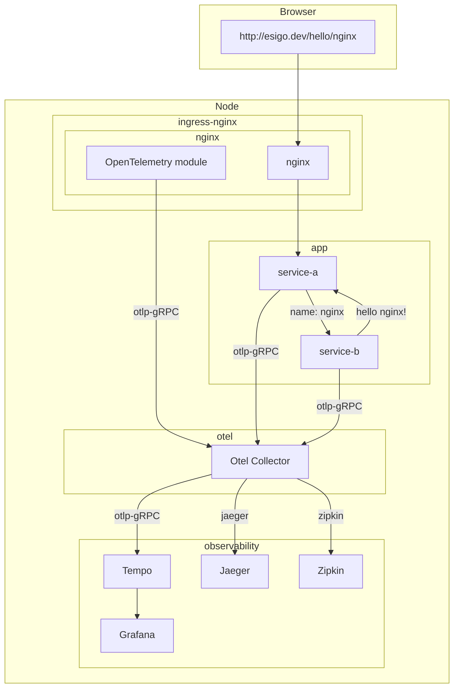
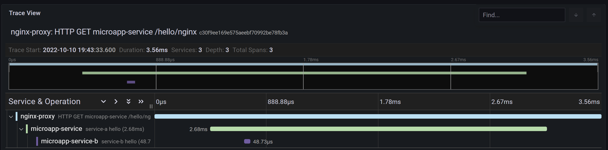
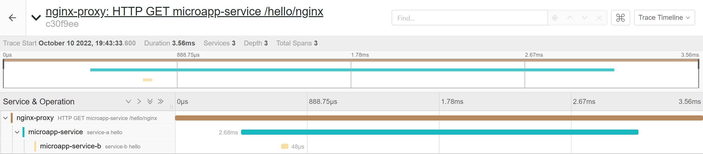

# OpenTelemetry

Enables requests served by NGINX for distributed telemetry via The OpenTelemetry Project.

Using the third party module [opentelemetry-cpp-contrib/nginx](https://github.com/open-telemetry/opentelemetry-cpp-contrib/tree/main/instrumentation/nginx) the NGINX ingress controller can configure NGINX to enable [OpenTelemetry](http://opentelemetry.io) instrumentation.
By default this feature is disabled.

## Usage

To enable the instrumentation we must enable OpenTelemetry in the configuration ConfigMap:
```yaml
data:
  enable-opentelemetry: "true"
```

To enable or disable instrumentation for a single Ingress, use
the `enable-opentelemetry` annotation:
```yaml
kind: Ingress
metadata:
  annotations:
    nginx.ingress.kubernetes.io/enable-opentelemetry: "true"
```

We must also set the host to use when uploading traces:

```yaml
otlp-collector-host: "otel-coll-collector.otel.svc"
```
NOTE: While the option is called `otlp-collector-host`, you will need to point this to any backend that recieves otlp-grpc.

Next you will need to deploy a distributed telemetry system which uses OpenTelemetry.
[opentelemetry-collector](https://github.com/open-telemetry/opentelemetry-collector), [Jaeger](https://www.jaegertracing.io/)
[Tempo](https://github.com/grafana/tempo), and [zipkin](https://zipkin.io/)
have been tested.

Other optional configuration options:
```yaml
# specifies the name to use for the server span
opentelemetry-operation-name

# sets whether or not to trust incoming telemetry spans
opentelemetry-trust-incoming-span

# specifies the port to use when uploading traces, Default: 4317
otlp-collector-port

# specifies the service name to use for any traces created, Default: nginx
otel-service-name

# The maximum queue size. After the size is reached data are dropped.
otel-max-queuesize

# The delay interval in milliseconds between two consecutive exports.
otel-schedule-delay-millis
        
# How long the export can run before it is cancelled.
otel-schedule-delay-millis

# The maximum batch size of every export. It must be smaller or equal to maxQueueSize.
otel-max-export-batch-size

# specifies sample rate for any traces created, Default: 0.01
otel-sampler-ratio

# specifies the sampler to be used when sampling traces.
# The available samplers are: AlwaysOn,  AlwaysOff, TraceIdRatioBased, Default: AlwaysOff
otel-sampler

# Uses sampler implementation which by default will take a sample if parent Activity is sampled, Default: false
otel-sampler-parent-based
```

Note that you can also set whether to trust incoming spans (global default is true) per-location using annotations like the following:
```yaml
kind: Ingress
metadata:
  annotations:
    nginx.ingress.kubernetes.io/opentelemetry-trust-incoming-span: "true"
```

## Examples

The following examples show how to deploy and test different distributed telemetry systems. These example can be performed using Docker Desktop.

In the [esigo/nginx-example](https://github.com/esigo/nginx-example)
GitHub repository is an example of a simple hello service:



To install the example and collectors run:

1. Enable Ingress addon with:

    ```yaml
      opentelemetry:
        enabled: true
        image: registry.k8s.io/ingress-nginx/opentelemetry:v20230107-helm-chart-4.4.2-2-g96b3d2165@sha256:331b9bebd6acfcd2d3048abbdd86555f5be76b7e3d0b5af4300b04235c6056c9
        containerSecurityContext:
        allowPrivilegeEscalation: false
    ```

2. Enable OpenTelemetry and set the otlp-collector-host:

    ```yaml
    $ echo '
      apiVersion: v1
      kind: ConfigMap
      data:
        enable-opentelemetry: "true"
        opentelemetry-config: "/etc/nginx/opentelemetry.toml"
        opentelemetry-operation-name: "HTTP $request_method $service_name $uri"
        opentelemetry-trust-incoming-span: "true"
        otlp-collector-host: "otel-coll-collector.otel.svc"
        otlp-collector-port: "4317"
        otel-max-queuesize: "2048"
        otel-schedule-delay-millis: "5000"
        otel-max-export-batch-size: "512"
        otel-service-name: "nginx-proxy" # Opentelemetry resource name
        otel-sampler: "AlwaysOn" # Also: AlwaysOff, TraceIdRatioBased
        otel-sampler-ratio: "1.0"
        otel-sampler-parent-based: "false"
      metadata:
        name: ingress-nginx-controller
        namespace: ingress-nginx
      ' | kubectl replace -f -
    ```

4. Deploy otel-collector, grafana and Jaeger backend:

    ```bash
    # add helm charts needed for grafana and OpenTelemetry collector
    helm repo add open-telemetry https://open-telemetry.github.io/opentelemetry-helm-charts
    helm repo add grafana https://grafana.github.io/helm-charts
    helm repo update
    # deply cert-manager needed for OpenTelemetry collector operator
    kubectl apply -f https://github.com/cert-manager/cert-manager/releases/download/v1.9.1/cert-manager.yaml
    # create observability namespace
    kubectl apply -f https://raw.githubusercontent.com/esigo/nginx-example/main/observability/namespace.yaml
    # install OpenTelemetry collector operator
    helm upgrade --install otel-collector-operator -n otel --create-namespace open-telemetry/opentelemetry-operator
    # deploy OpenTelemetry collector
    kubectl apply -f https://raw.githubusercontent.com/esigo/nginx-example/main/observability/collector.yaml
    # deploy Jaeger all-in-one
    kubectl apply -f https://github.com/jaegertracing/jaeger-operator/releases/download/v1.37.0/jaeger-operator.yaml -n observability
    kubectl apply -f https://raw.githubusercontent.com/esigo/nginx-example/main/observability/jaeger.yaml -n observability
    # deploy zipkin
    kubectl apply -f https://raw.githubusercontent.com/esigo/nginx-example/main/observability/zipkin.yaml -n observability
    # deploy tempo and grafana
	helm upgrade --install tempo grafana/tempo --create-namespace -n observability
	helm upgrade -f https://raw.githubusercontent.com/esigo/nginx-example/main/observability/grafana/grafana-values.yaml --install grafana grafana/grafana --create-namespace -n observability
    ```

3. Build and deploy demo app:

    ```bash
    # build images
    make images

    # deploy demo app:
    make deploy-app
    ```

5. Make a few requests to the Service:

    ```bash
    kubectl port-forward --namespace=ingress-nginx service/ingress-nginx-controller 8090:80
    curl http://esigo.dev:8090/hello/nginx


    StatusCode        : 200
    StatusDescription : OK
    Content           : {"v":"hello nginx!"}

    RawContent        : HTTP/1.1 200 OK
                        Connection: keep-alive
                        Content-Length: 21
                        Content-Type: text/plain; charset=utf-8
                        Date: Mon, 10 Oct 2022 17:43:33 GMT

                        {"v":"hello nginx!"}

    Forms             : {}
    Headers           : {[Connection, keep-alive], [Content-Length, 21], [Content-Type, text/plain; charset=utf-8], [Date,
                        Mon, 10 Oct 2022 17:43:33 GMT]}
    Images            : {}
    InputFields       : {}
    Links             : {}
    ParsedHtml        : System.__ComObject
    RawContentLength  : 21
    ```

6. View the Grafana UI:

    ```bash
    kubectl port-forward --namespace=observability service/grafana 3000:80
    ```
    In the Grafana interface we can see the details:
    

7. View the Jaeger UI:

    ```bash
    kubectl port-forward --namespace=observability service/jaeger-all-in-one-query 16686:16686
    ```
    In the Jaeger interface we can see the details:
    

8. View the Zipkin UI:

    ```bash
    kubectl port-forward --namespace=observability service/zipkin 9411:9411
    ```
    In the Zipkin interface we can see the details:
    
