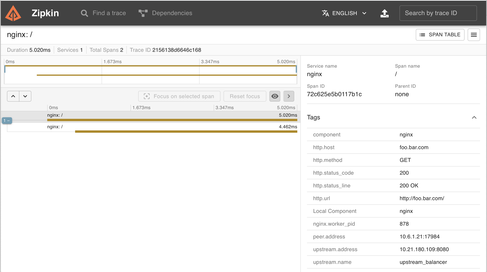
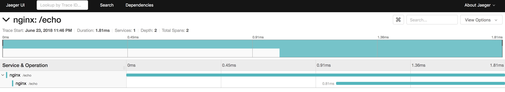

# OpenTracing

Enables requests served by NGINX for distributed tracing via The OpenTracing Project.

Using the third party module [opentracing-contrib/nginx-opentracing](https://github.com/opentracing-contrib/nginx-opentracing) the NGINX ingress controller can configure NGINX to enable [OpenTracing](http://opentracing.io) instrumentation.
By default this feature is disabled.

## Usage

To enable the instrumentation we must enable OpenTracing in the configuration ConfigMap:
```
data:
  enable-opentracing: "true"
```

We must also set the host to use when uploading traces:

```
zipkin-collector-host: zipkin.default.svc.cluster.local
jaeger-collector-host: jaeger-collector.default.svc.cluster.local
```
NOTE: While the option is called `jaeger-collector-host`, you will need to point this to a `jaeger-agent`, and not the `jaeger-collector` component.  

Next you will need to deploy a distributed tracing system which uses OpenTracing. Both [Zipkin](https://github.com/openzipkin/zipkin) and
[Jaeger](https://github.com/jaegertracing/jaeger) have been tested.

Other optional configuration options:
```
# specifies the port to use when uploading traces, Default: 9411
zipkin-collector-port

# specifies the service name to use for any traces created, Default: nginx
zipkin-service-name

# specifies sample rate for any traces created, Default: 1.0
zipkin-sample-rate

# specifies the port to use when uploading traces, Default: 6831
jaeger-collector-port

# specifies the service name to use for any traces created, Default: nginx
jaeger-service-name

# specifies the sampler to be used when sampling traces.
# The available samplers are: const, probabilistic, ratelimiting, remote, Default: const
jaeger-sampler-type

# specifies the argument to be passed to the sampler constructor, Default: 1
jaeger-sampler-param
```

All these options (including host) allow environment variables, such as `$HOSTNAME` or `$HOST_IP`. In the case of Jaeger, if you have a Jaeger agent running on each machine in your cluster, you can use something like `$HOST_IP` (which can be 'mounted' with the `status.hostIP` fieldpath, as described [here](https://kubernetes.io/docs/tasks/inject-data-application/downward-api-volume-expose-pod-information/#capabilities-of-the-downward-api)) to make sure traces will be sent to the local agent.

## Examples

The following examples show how to deploy and test different distributed tracing systems. These example can be performed
using Minikube.

### Zipkin

In the [rnburn/zipkin-date-server](https://github.com/rnburn/zipkin-date-server)
GitHub repository is an example of a dockerized date service. To install the example and Zipkin collector run:

```
kubectl create -f https://raw.githubusercontent.com/rnburn/zipkin-date-server/master/kubernetes/zipkin.yaml
kubectl create -f https://raw.githubusercontent.com/rnburn/zipkin-date-server/master/kubernetes/deployment.yaml
```

Also we need to configure the NGINX controller ConfigMap with the required values:

```
$ echo '
apiVersion: v1
kind: ConfigMap
data:
  enable-opentracing: "true"
  zipkin-collector-host: zipkin.default.svc.cluster.local
metadata:
  name: nginx-configuration
  namespace: kube-system
' | kubectl replace -f -
```

In the Zipkin interface we can see the details:


### Jaeger

1. Enable Ingress addon in Minikube:
    ```
    $ minikube addons enable ingress
    ```

2. Add Minikube IP to /etc/hosts:
    ```
    $ echo "$(minikube ip) example.com" | sudo tee -a /etc/hosts
    ```

3. Apply a basic Service and Ingress Resource:
    ```
    # Create Echoheaders Deployment
    $ kubectl run echoheaders --image=k8s.gcr.io/echoserver:1.4 --replicas=1 --port=8080

    # Expose as a Cluster-IP
    $ kubectl expose deployment echoheaders --port=80 --target-port=8080 --name=echoheaders-x

    # Apply the Ingress Resource
    $ echo '
      apiVersion: extensions/v1beta1
      kind: Ingress
      metadata:
        name: echo-ingress
      spec:
        rules:
        - host: example.com
          http:
            paths:
            - backend:
                serviceName: echoheaders-x
                servicePort: 80
              path: /echo
      ' | kubectl apply -f -
    ```

4. Enable OpenTracing and set the jaeger-collector-host:
    ```
    $ echo '
      apiVersion: v1
      kind: ConfigMap
      data:
        enable-opentracing: "true"
        jaeger-collector-host: jaeger-collector.default.svc.cluster.local
      metadata:
        name: nginx-configuration
        namespace: kube-system
      ' | kubectl replace -f -
    ```

5. Apply the Jaeger All-In-One Template:
    ```
    $ kubectl apply -f https://raw.githubusercontent.com/jaegertracing/jaeger-kubernetes/master/all-in-one/jaeger-all-in-one-template.yml
    ```

6. Make a few requests to the Service:
    ```
    $ curl example.com/echo -d "meow"

    CLIENT VALUES:
    client_address=172.17.0.5
    command=POST
    real path=/echo
    query=nil
    request_version=1.1
    request_uri=http://example.com:8080/echo

    SERVER VALUES:
    server_version=nginx: 1.10.0 - lua: 10001

    HEADERS RECEIVED:
    accept=*/*
    connection=close
    content-length=4
    content-type=application/x-www-form-urlencoded
    host=example.com
    user-agent=curl/7.54.0
    x-forwarded-for=192.168.99.1
    x-forwarded-host=example.com
    x-forwarded-port=80
    x-forwarded-proto=http
    x-original-uri=/echo
    x-real-ip=192.168.99.1
    x-scheme=http
    BODY:
    meow
    ```

7. View the Jaeger UI:
    ```
    $ minikube service jaeger-query --url

    http://192.168.99.100:30183
    ```

    In the Jaeger interface we can see the details:
    
