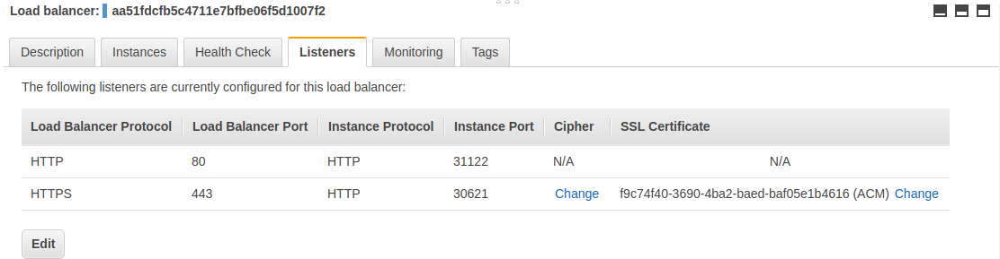

### Elastic Load Balancer for TLS termination

This example shows the required steps to use classic Elastic Load Balancer for TLS termination. 

Change line of the file `elb-tls-nginx-ingress-controller.yaml` replacing the dummy id with a valid one `"arn:aws:acm:us-west-2:XXXXXXXX:certificate/XXXXXX-XXXXXXX-XXXXXXX-XXXXXXXX"`

Then execute:
```
$ kubectl create -f elb-tls-nginx-ingress-controller.yaml
```

This example creates an ELB with just two listeners, one in port 80 and another in port 443


