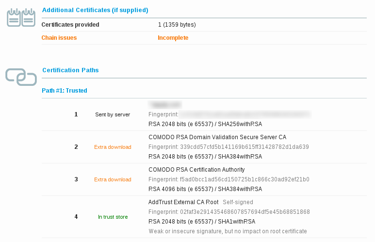

# SSL certificate chain resolver

[](https://circleci.com/gh/zakjan/cert-chain-resolver)
[](https://tldrlegal.com/license/mit-license)

This application downloads all intermediate CA certificates for a given SSL server certificate. It can help you fix the *incomplete certificate chain* issue, also reported as *Extra download* by [Qualys SSL Server Test](https://www.ssllabs.com/ssltest/).

See Releases for prebuilt binaries or build it yourself.

NOTE: In case of any troubles with Go you can try the deprecated shell script in [shell](https://github.com/zakjan/cert-chain-resolver/tree/shell) branch.

## Usage

```
NAME:
   cert-chain-resolver - SSL certificate chain resolver

USAGE:
   cert-chain-resolver [global options] [INPUT_FILE]

VERSION:
   1.0.1

GLOBAL OPTIONS:
   --output OUTPUT_FILE, -o OUTPUT_FILE  output to OUTPUT_FILE (default: stdout)
   --intermediate-only, -i               output intermediate certificates only
   --der, -d                             output DER format
   --include-system, -s                  include root CA from system in output
   --version, -v                         print the version
```

## Example

```
$ cert-chain-resolver -o domain.bundle.pem domain.pem
1: *.xxx.com
2: COMODO RSA Domain Validation Secure Server CA
3: COMODO RSA Certification Authority
Certificate chain complete.
Total 3 certificate(s) found.
```

## Build

Dependencies:

* Go 1.6
* project cloned in `$GOPATH` (otherwise vendoring doesn't work, see https://github.com/golang/go/issues/12511)

```
go get github.com/Masterminds/glide
glide install
go build
```

## Tests

```
go test $(glide novendor)
tests/run.sh
```

## Background



All operating systems contain a set of default trusted root certificates. But CAs usually don't use their root certificate to sign customer certificates. Instead of they use so called intermediate certificates, because they can be rotated more frequently.

A certificate can contain a special *Authority Information Access* extension ([RFC-3280](http://tools.ietf.org/html/rfc3280)) with URL to issuer's certificate. Most browsers can use the AIA extension to download missing intermediate certificate to complete the certificate chain. This is the exact meaning of the *Extra download* message. But some clients (mobile browsers, OpenSSL) don't support this extension, so they report such certificate as untrusted.

A server should always send a complete chain, which means concatenated all certificates from the certificate to the trusted root certificate (exclusive, in this order), to prevent such issues. Note, the trusted root certificate should not be there, as it is already included in the system’s root certificate store.

You should be able to fetch intermediate certificates from the issuer and concat them together by yourself, this script helps you automatize it by looping over certificate's AIA extension field.

### Other implementations

* [deprecated shell script](https://github.com/zakjan/cert-chain-resolver/tree/shell) (shell)
* [https://certificatechain.io/](https://certificatechain.io/) (webservice)
* [freekmurze/ssl-certificate-chain-resolver](https://github.com/freekmurze/ssl-certificate-chain-resolver) (PHP)

### Licence

The MIT License (MIT). See [LICENCE](LICENCE) file for more information. [TL;DR](https://tldrlegal.com/license/mit-license)

If you use my code in some interesting project, I'd be happy to know about it.
